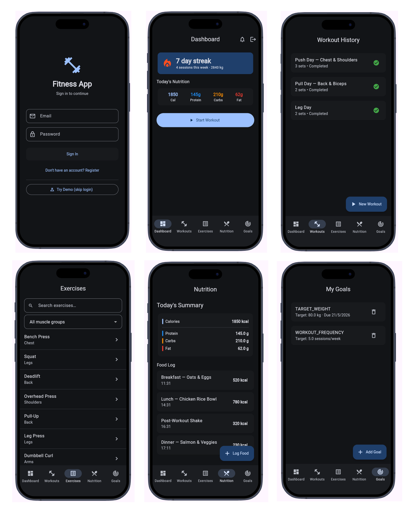

# Claude Code Agent Teams: Full-Stack Fitness App Demo


[](https://deepwiki.com/kumaran-is/claude-agent-teams-demo-app)
[](https://docs.anthropic.com/en/docs/claude-code)
[](https://medium.com/@kumaran.isk/claude-code-beyond-sub-agents-orchestrating-peer-to-peer-ai-with-agent-teams-3406d2169bfd)
[](https://medium.com/@kumaran.isk/claude-code-agent-teams-a-7-agent-full-stack-app-playbook-f584a7fa1a69)


This project is a comprehensive demo of a full-stack application built using **Claude Code Agent Teams**. It demonstrates how to orchestrate seven specialized AI agents to handle parallel workstreams, manage shared contracts, and enforce dependency gating in a single terminal session.

## Overview
The application is a high-performance fitness tracker that manages the entire lifecycle of user health data—from workout logging and exercise discovery to nutrition tracking and goal setting. 


## Tech Stack
*   **Mobile Frontend:** Flutter / Dart (iOS + Android)
*   **Backend API:** Java / Spring Boot WebFlux (Reactive REST)
*   **Database:** PostgreSQL
*   **Authentication:** Firebase Auth with JWT validation
*   **Notifications:** Firebase Cloud Messaging
*   **Deployment:** Docker containerization

## Key Features
*   **Workout & Exercise Tracking:** Create and log workout sessions, track sets, and search a comprehensive exercise library filterable by muscle group.
*   **Progress Metrics:** Monitor weekly stats, streaks, and personal records.
*   **Nutrition Logging:** Log daily macros including calories, protein, carbs, and fat.
*   **Goal Setting:** Set and track targets for body weight and workout frequency.
*   **Automated Quality Gates:** Integrated **code reviews** and **security audits** (Auth, OWASP, secrets scanning) are triggered automatically as modules are completed.

## Quick Start
Here's a ready-to-paste prompt into a Claude Code session to launch the fitness app:   

```json
  Launch the Fitness App for local development.                                                                                                                                                                           
                                                                                   
  ## What to do

  1. **Start Docker services** (PostgreSQL + Spring Boot backend):
     - cd into `backend/`
     - Run `docker-compose up -d`
     - PostgreSQL runs on port 5433 (not 5432 — conflict with another container)
     - Wait for both containers to be healthy

  2. **Run Flutter on Chrome with DevicePreview**:
     - cd into `mobile/`
     - Kill any existing flutter run processes on port 3457 first
     - Run: `flutter run -d chrome --web-port 3457`
     - DevicePreview is already configured in main.dart — no changes needed

  ## Known context
  - Flutter SDK: Dart 3.10.4 (pubspec uses `>=3.10.0`)
  - Demo mode: tap "Try Demo (skip login)" on the login screen to bypass Firebase auth
  - All screens use mock data in demo mode — no real backend connection needed to see data
  - build_runner outputs are already generated (*.g.dart / *.freezed.dart files exist)
  - If build_runner is needed: `dart run build_runner build --delete-conflicting-outputs`

  ## If flutter is already running
  - Check with: `lsof -i :3457`
  - Kill with: `kill -9 <PID>`
  - Then relaunch

  Open http://localhost:3457 in Chrome once flutter run shows the debug service URL.
```
