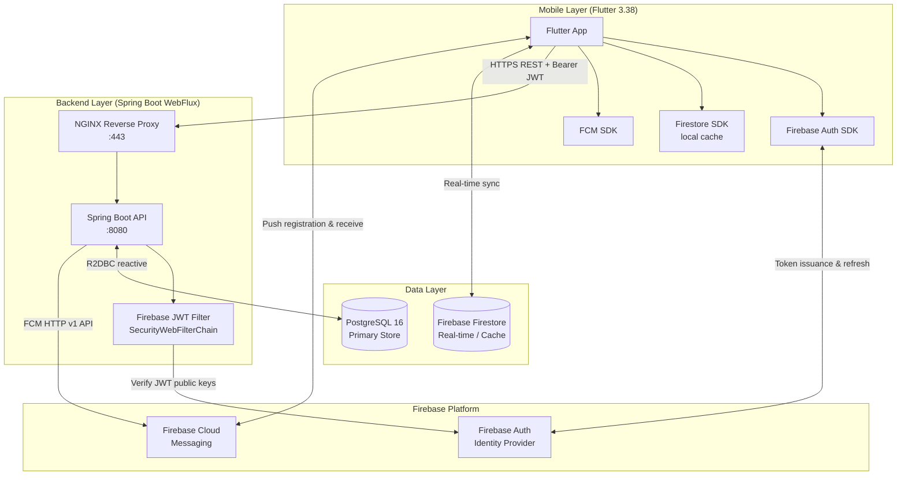
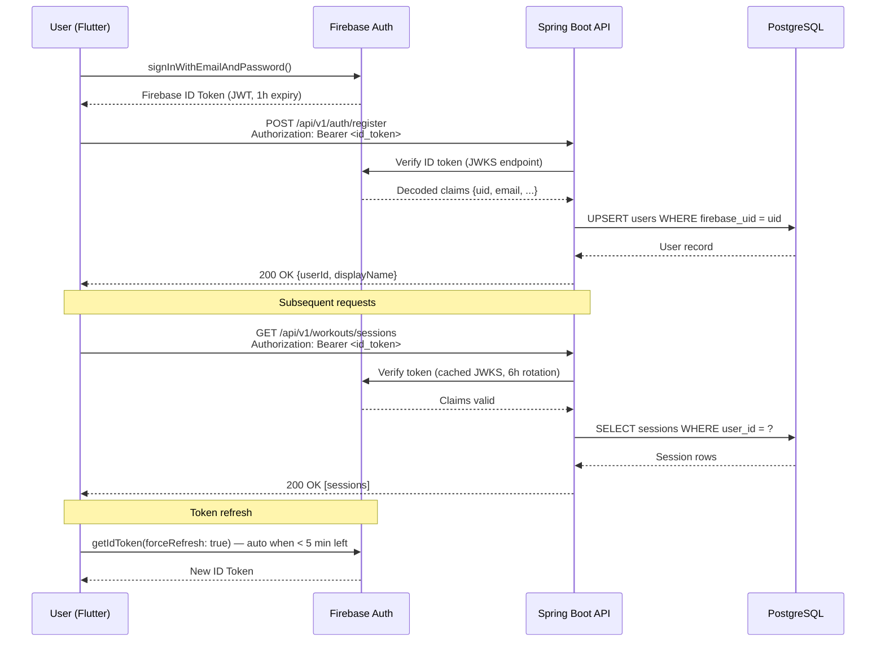
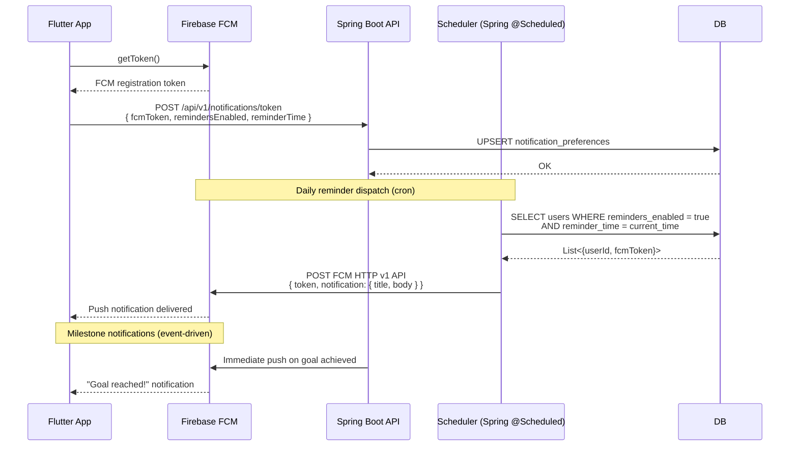
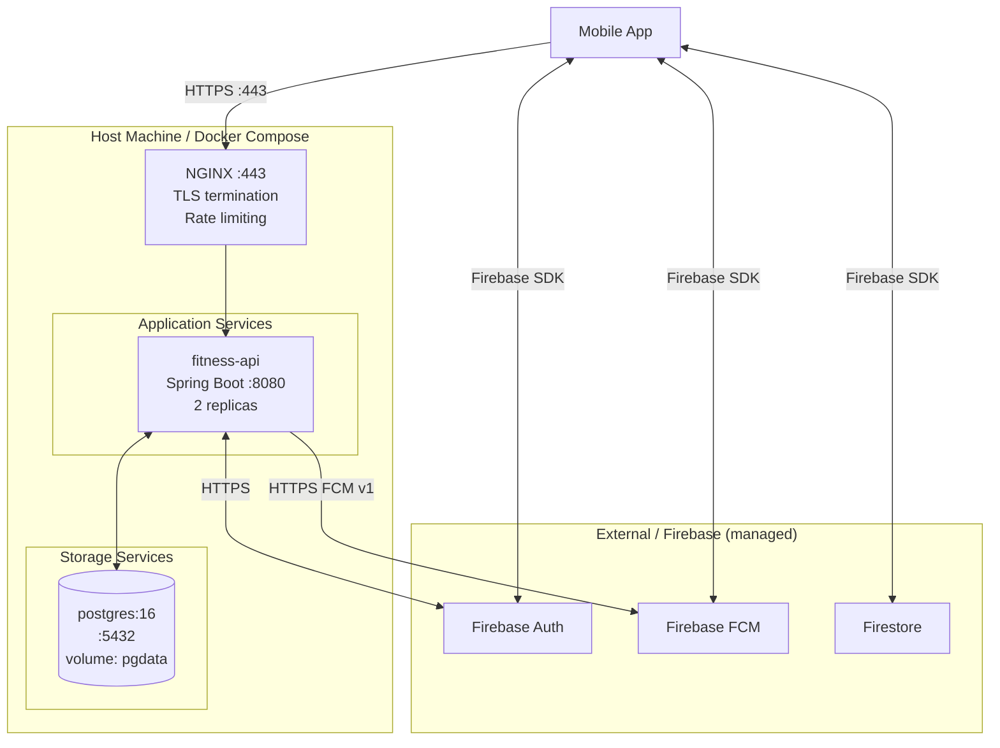

# Fitness App — System Architecture

## Executive Summary

The Fitness App is a cross-platform mobile application that enables users to track workouts, log nutrition, set fitness goals, and receive personalized push notifications. It is built on a modern reactive stack:

- **Mobile client**: Flutter 3.38 (iOS + Android) with Firebase Auth and offline-first Firestore cache
- **Backend API**: Java 21 / Spring Boot 3.5.x (WebFlux reactive) providing RESTful endpoints secured by Firebase JWT validation
- **Primary database**: PostgreSQL 16 for all persistent user data (workouts, nutrition, goals)
- **Firebase platform**: Firebase Auth (identity), Firebase Cloud Messaging (push notifications), Firestore (real-time sync cache on mobile)
- **Infrastructure**: Docker Compose (development), containerised services behind an NGINX reverse proxy

The system targets < 300 ms P95 API latency, 99.9 % uptime, and offline read access for mobile users.

---

## High-Level System Architecture



---

## Component Breakdown

### Flutter Mobile

| Component | Responsibility |
|-----------|---------------|
| **Auth screens** | Sign-in / sign-up via Firebase Auth (email+password, Google Sign-In) |
| **Riverpod providers** | State management — exposes `AsyncValue<T>` to UI |
| **Repository layer** | Abstracts REST API calls; returns Freezed domain models |
| **Firestore cache** | Offline read access; syncs workout summaries and goals |
| **FCM handler** | Receives push notifications; routes deep-links to screens |
| **Local storage** | `flutter_secure_storage` for token caching; `shared_preferences` for settings |

### Spring Boot WebFlux Backend

| Module | Responsibility |
|--------|---------------|
| **Security filter** | Validates Firebase ID tokens on every authenticated request |
| **Auth module** | User registration/profile sync from Firebase UID |
| **Exercises module** | CRUD for exercises and muscle groups |
| **Workouts module** | Workout session recording and metrics aggregation |
| **Nutrition module** | Daily food logging and macro summaries |
| **Goals module** | Fitness goal creation and progress tracking |
| **Notifications module** | FCM token management and scheduled reminder dispatch |

### PostgreSQL

All user-generated data persists in PostgreSQL. The schema is designed in `docs/database-schema.md`.

### Firebase Platform

| Service | Usage |
|---------|-------|
| **Firebase Auth** | Identity provider; issues ID tokens (JWTs) to the mobile app |
| **Firestore** | Real-time cache for workout summaries and goal progress on mobile |
| **FCM** | Delivers workout reminders and milestone push notifications |

---

## Firebase Auth Flow — JWT Token Lifecycle



Key points:
- Firebase issues RS256-signed JWTs; the backend validates using Firebase's JWKS public keys cached for 6 hours.
- No session storage on the backend — fully stateless.
- Token expiry is 1 hour; the Flutter SDK auto-refreshes transparently.
- On first login the backend performs an UPSERT to synchronise the Firebase UID with the internal `users` table.

---

## Firebase Cloud Messaging — Push Notification Flow



---

## REST API Module Overview

All endpoints are prefixed `/api/v1/`. Authenticated endpoints require `Authorization: Bearer <firebase_id_token>`.

### Auth — `/api/v1/auth`

| Method | Path | Description | Auth |
|--------|------|-------------|------|
| POST | `/api/v1/auth/register` | Register / sync Firebase user to DB | Bearer |
| GET | `/api/v1/auth/me` | Get current user profile | Bearer |
| PUT | `/api/v1/auth/me` | Update display name / settings | Bearer |

### Exercises — `/api/v1/exercises`, `/api/v1/muscle-groups`

| Method | Path | Description | Auth |
|--------|------|-------------|------|
| GET | `/api/v1/exercises` | List all exercises (paginated, filterable by muscle group) | Bearer |
| GET | `/api/v1/exercises/{id}` | Get exercise detail | Bearer |
| POST | `/api/v1/exercises` | Create custom exercise | Bearer |
| PUT | `/api/v1/exercises/{id}` | Update exercise (own only) | Bearer |
| DELETE | `/api/v1/exercises/{id}` | Delete exercise (own only) | Bearer |
| GET | `/api/v1/muscle-groups` | List all muscle groups | Bearer |

### Workouts — `/api/v1/workouts/sessions`, `/api/v1/workouts/metrics`

| Method | Path | Description | Auth |
|--------|------|-------------|------|
| GET | `/api/v1/workouts/sessions` | List sessions (paginated, date filter) | Bearer |
| POST | `/api/v1/workouts/sessions` | Start new workout session | Bearer |
| GET | `/api/v1/workouts/sessions/{id}` | Get session with sets | Bearer |
| PUT | `/api/v1/workouts/sessions/{id}` | Update session (complete, add notes) | Bearer |
| DELETE | `/api/v1/workouts/sessions/{id}` | Delete session | Bearer |
| POST | `/api/v1/workouts/sessions/{id}/sets` | Add set to session | Bearer |
| PUT | `/api/v1/workouts/sessions/{id}/sets/{setId}` | Update set | Bearer |
| DELETE | `/api/v1/workouts/sessions/{id}/sets/{setId}` | Delete set | Bearer |
| GET | `/api/v1/workouts/metrics` | Aggregated metrics (volume, frequency, PRs) | Bearer |

### Nutrition — `/api/v1/nutrition/logs`, `/api/v1/nutrition/summary`

| Method | Path | Description | Auth |
|--------|------|-------------|------|
| GET | `/api/v1/nutrition/logs` | List logs (date range) | Bearer |
| POST | `/api/v1/nutrition/logs` | Create nutrition log entry | Bearer |
| PUT | `/api/v1/nutrition/logs/{id}` | Update log entry | Bearer |
| DELETE | `/api/v1/nutrition/logs/{id}` | Delete log entry | Bearer |
| GET | `/api/v1/nutrition/summary` | Daily/weekly macro summary | Bearer |

### Goals — `/api/v1/goals`

| Method | Path | Description | Auth |
|--------|------|-------------|------|
| GET | `/api/v1/goals` | List user goals | Bearer |
| POST | `/api/v1/goals` | Create goal | Bearer |
| GET | `/api/v1/goals/{id}` | Get goal detail + progress | Bearer |
| PUT | `/api/v1/goals/{id}` | Update goal | Bearer |
| DELETE | `/api/v1/goals/{id}` | Delete goal | Bearer |

### Notifications — `/api/v1/notifications`

| Method | Path | Description | Auth |
|--------|------|-------------|------|
| POST | `/api/v1/notifications/token` | Register / update FCM token and preferences | Bearer |
| GET | `/api/v1/notifications/preferences` | Get current notification preferences | Bearer |
| DELETE | `/api/v1/notifications/token` | Unregister FCM token (logout) | Bearer |

---

## Docker Deployment Topology



**Docker Compose services:**

| Service | Image | Port | Notes |
|---------|-------|------|-------|
| `nginx` | `nginx:alpine` | 443 | TLS termination; proxies to `fitness-api:8080` |
| `fitness-api` | `fitness-api:latest` | 8080 (internal) | Spring Boot WebFlux; reads `FIREBASE_PROJECT_ID`, `DB_*` env vars |
| `postgres` | `postgres:16-alpine` | 5432 (internal) | Persistent volume `pgdata`; health-checked |

---

## Technology Decisions

| Technology | Version | Decision Rationale |
|------------|---------|-------------------|
| **Flutter** | 3.38 | Single codebase for iOS + Android; excellent Firebase SDK support; Riverpod for testable reactive state |
| **Java / Spring Boot WebFlux** | 21 / 3.5.x | Reactive I/O handles high-concurrency fitness logging with low thread overhead; WebFlux + R2DBC is non-blocking end-to-end |
| **PostgreSQL** | 16 | ACID transactions for workout sets and nutrition logs; rich aggregation (CTEs, window functions) for metrics; proven reliability |
| **Firebase Auth** | — | Removes auth infrastructure burden; handles OAuth providers, token rotation, and device revocation out of the box |
| **Firebase Firestore** | — | Offline-first cache for mobile; real-time sync of goal progress without polling the REST API |
| **Firebase FCM** | — | Cross-platform push notifications with guaranteed delivery; integrates natively with Flutter |
| **Docker Compose** | — | Dev environment parity; single `docker-compose up` for full stack; easy CI integration |
| **NGINX** | alpine | Battle-tested reverse proxy; handles TLS termination and rate limiting before traffic reaches the app |
| **R2DBC + Project Reactor** | — | Non-blocking database driver required to stay reactive throughout Spring WebFlux pipeline |

---

## Non-Functional Requirements

### Performance
- **P95 API latency**: < 300 ms for all read endpoints under 100 concurrent users
- **Workout session recording**: < 200 ms for `POST /workouts/sessions/{id}/sets` (hot path)
- **Nutrition summary aggregation**: < 500 ms for 30-day macro rollup
- **Cold start**: API container ready to serve within 20 seconds

### Security
- All traffic over HTTPS (TLS 1.2+)
- Firebase JWT validated on every authenticated request; tokens never stored server-side
- No sensitive data (passwords, tokens) logged
- CORS restricted to the Firebase Hosting origin in production
- Rate limiting: 100 req/min per IP at NGINX; 1000 req/min per authenticated user at app level

### Scalability
- Stateless API service — horizontal scale by adding replicas behind NGINX upstream
- PostgreSQL connection pool sized via R2DBC pool (min 5, max 20 per replica)
- Read-heavy endpoints (exercise list, muscle groups) cacheable with `Cache-Control` headers

### Availability
- Target: 99.9 % uptime (≤ 8.7 h/year downtime)
- PostgreSQL with WAL archiving + daily `pg_dump` backups
- NGINX health-check `/health` → Spring Actuator `/actuator/health`

### Observability
- Spring Actuator: `/actuator/health`, `/actuator/metrics`, `/actuator/prometheus`
- Structured JSON logging via Logback; log level configurable via env var `LOG_LEVEL`
- Request correlation ID propagated via `X-Request-ID` header through the reactive chain

---

## Security Architecture

### JWT Validation Pipeline

```
HTTP Request
    │
    ▼
NGINX (rate limit, TLS strip)
    │
    ▼
SecurityWebFilterChain
    ├─ PublicPaths: /actuator/health  →  pass through
    └─ Protected paths: extract Bearer token
            │
            ▼
        FirebaseJwtAuthFilter
            ├─ Decode JWT header (no secret needed)
            ├─ Verify signature against Firebase JWKS
            │   (cached 6 h, refreshed on key rotation)
            ├─ Verify exp, aud (== FIREBASE_PROJECT_ID), iss
            └─ Inject FirebaseAuthenticationToken into SecurityContext
                    │
                    ▼
                Controller / Service
                    └─ Extract uid from Authentication principal
```

### Threat Model & Controls

| Threat | Control |
|--------|---------|
| Token replay after logout | Firebase token revocation; client deletes token on logout |
| SQL injection | R2DBC parameterised queries only — no string concatenation |
| Broken object-level authorisation | Every query scoped to `user_id` from JWT claims |
| Mass assignment | Explicit `@JsonProperty` DTOs; no entity exposure at API boundary |
| Secrets exposure | All credentials in env vars; `.env` excluded via `.gitignore` |
| Rate abuse | NGINX 100 req/min per IP; Spring `@RateLimiter` on auth endpoints |
| CORS misconfiguration | `WebFluxConfigurer.addCorsMappings()` allows only Firebase Hosting origin |
| Dependency vulnerabilities | `mvn dependency-check:check` in CI pipeline |
